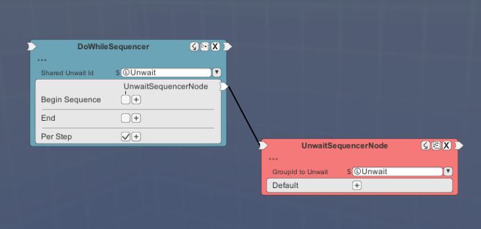
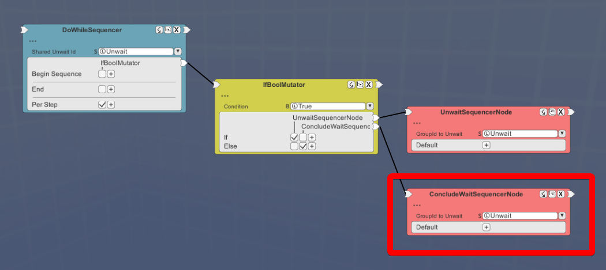
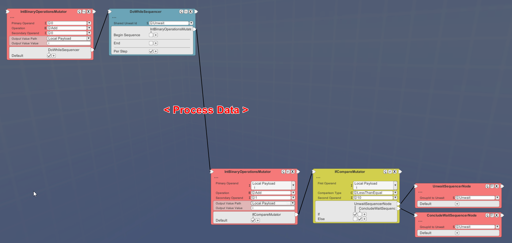

# Creating Loops

If a package requires repeated evaluation, you may use the DoWhileSequencer node to cycle through each iteration, an iteration ending with an UnwaitSequencer node.
   
  

The DoWhileSequencer takes a "Shared Unwait ID".  This is a string ID that provides a reference to the loop, registered to a global table.  The UnwaitSequencer uses that ID to refer to it from that table and starts another iteration.
   
  

Thus, the image above is equivalent to:  

    while(true) {
        continue;
    }

All currently active loops are cut short when a package is evaluated; before evaluation begins, the global table containing the reference to all loops is emptied.  This means that any loops that are designed run forever will end eventually.

If an explicit end to evaluation is needed, the ConcludeWaitSequencer node can be used to prevent a loop from firing again.
   
  

The image above is equivalent to:  

    while(true) {
        if(true) {
            continue;
        } else {
            break;
        }
    }

Iterating over an index is easy to perform:

The image above is equivalent to:  

    int i = 0;
    while(true) {

        // < Process Data >

        i = i + 1;
        if(i <= 10) {
            continue;
        } else {
            break;
        }
    }
***
    for(int i = 0; i <= 10; i++) {
        // < Process Data >
    }

