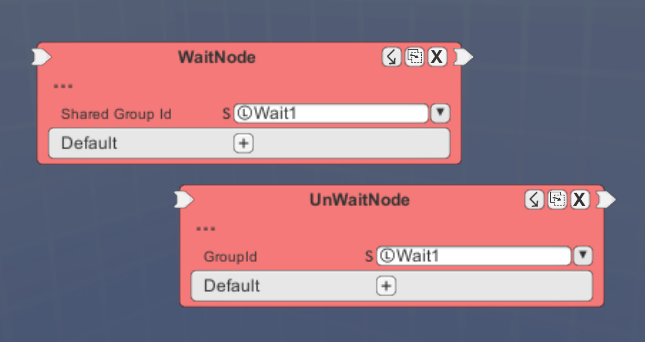
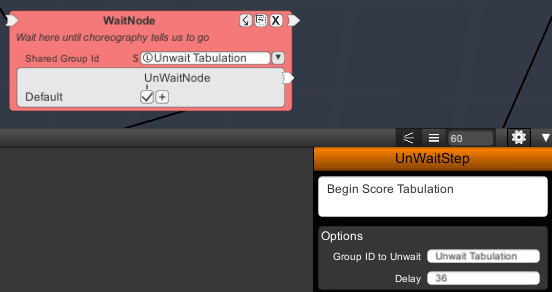

While a package will execute events in sequential order, there may be a requirement to wait until another segment of a package executes first.  The Wait node is used for that purpose.
   
  

Just like the DoWhileSequencer in loops, it will register itself on a string key to a global table.  However, the Wait node resumes execution when an UnWait node elsewhere uses the same key instead of an UnWaitSequencer node.  Also unlike the DoWhileSequencer, Wait nodes will only fire once for each time it is activated.
   
  

Wait nodes and UnWait nodes will usually be used alongside the equivalent Wait steps and UnWait steps in choreography.  This allows for synchronization between a long-running evaluation and the choreography that goes with it.