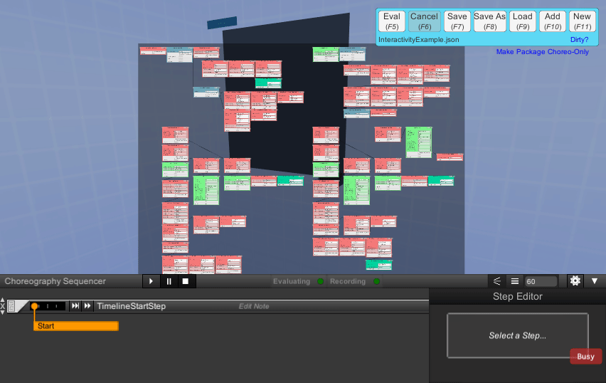
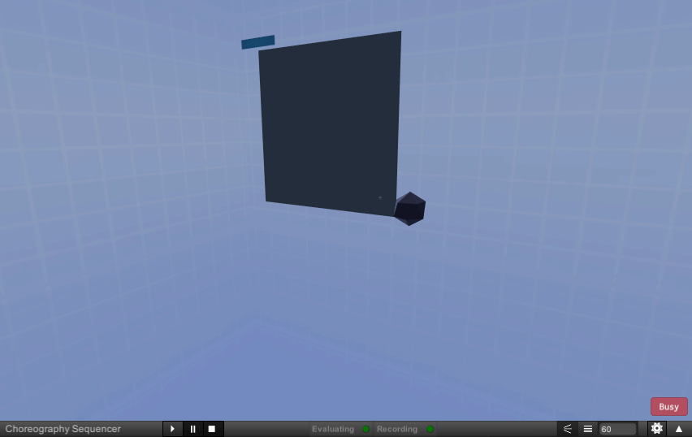
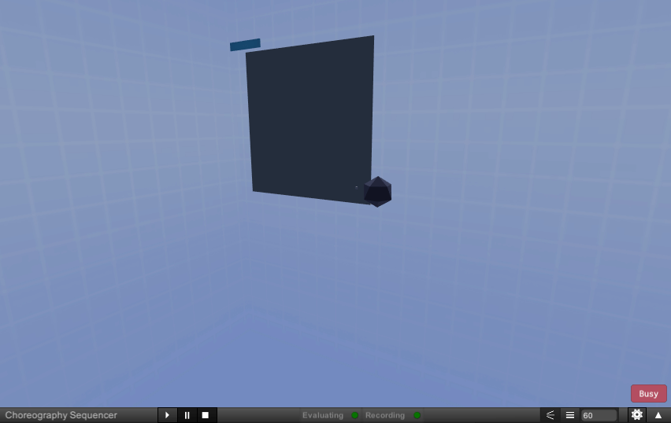

## Evaluation
The Main View allows for a user to get an interactive examination of the visualization produced by the package.  To start, pressing the Eval button or the F5 key on the keyboard executes the package.
   
  

## Hiding the Workspace and Choreography
Tab may be used to hide the Workspace, and Shift-Tab to collapse the choreography view, to provide an unobstructed view of the visualization.
   
  

Using the same keys will also show the Workspace again and expand the choreography.

## Manipulating the Camera
Clicking and dragging with the right mouse button will let you rotate the camera...
   
  

...while using the W, A, S, and D keys will move the camera in 3D space.
   
  

The Q and E keys may also be used to move the camera up or down, respectively.
   
  

If you lose your place in the space, pressing F12 on the keyboard will point your camera toward the origin.
   
  

