# Manipulating the Package Editor

## Overview
The Haxxis Package Editor allows control over how a package will intake, process, and render the data.  To that end, packages contain Chains, each of which consist of one or more Chain Nodes.  Each Chain Node takes in a batch of data, performs some processing on it, and emits that data to all of its children.  Chain Nodes can only have one parent, but may have multiple children:  
   
 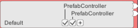 

## Chaining Nodes
Adding a child to a Chain Node is accomplished in one of two methods:  
Click the plus sign next to the state, then click the Chain Node you wish to attach to it.  
   
 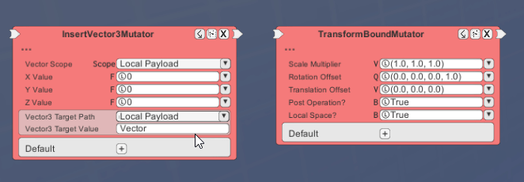 

OR Shift-left-click the Chain Node to attach, then click the plus sign next to the state to attach it to.  
   
 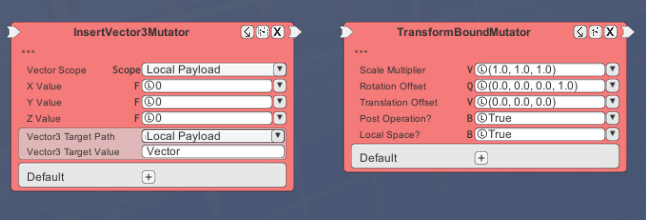 

Unticking the checkbox will remove the link between the Chain Nodes.
   
 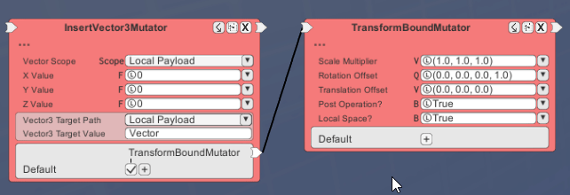 

  ***
  
Some Chain Nodes may emit data to different Chains under different circumstances - if that's the case, then multiple rows will display, sometimes broken by a line:
   
  

One Chain Node can be a member of multiple rows.
   
 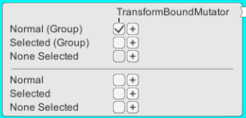 

However, a Chain Node can only be a member of one group - the lines denote the separation of the groups.
   
 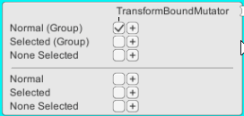 

## Mutable Objects
Each Chain Node will evaluate before passing its newly processed data to all child nodes.  All intermediate data is stored in a mapping format from string to object called a MutableObject.  MutableObjects can be thought of as trees, where an individual value is a leaf of that tree.  The shape of the tree is arbitrary, and some branches may represent an array of subtrees rather than a single subtree.  Many nodes operate by writing a new value for use down the chain, or overwriting a key-value pair already in use with a new value.

Chain execution follows a grouped order depending on the types of the root nodes in each chain.  First, any chains starting with an EarlyExecutionNode or CommandLineArgumentAdapter are executed, including all dependent nodes.  Finally, all other chains are evaluated.  This is used to ensure that requisite setup steps are guaranteed to be performed before normal chain execution, including declaration of global variables and ingestion of command-line arguments.

## Mutable Targets
When a Chain Node processes data and produces mutable data results, the Chain Node will have one or more Mutable Targets on it:
   
 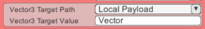 

MutableTargets allow the package designer to designate the name and location of the output datum.  The path (the pulldown) dictates the branch of the mutable object the new value will be placed, and the value (the text field) dictates the name.

## Mutable Fields  
   
 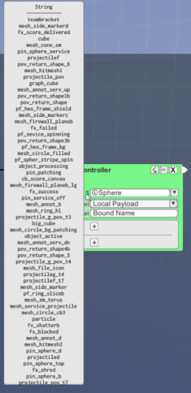 

   
 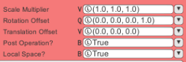 

The majority of Chain Nodes will have a variety of arguments that influence their operation, here called mutable fields.  All mutable fields involve a type and a value - the value being either literal or mutable.  

- The type of a mutable field is indicated on the left; the first character of the name of the type is shown, and hovering over the character will show the full name of the type.
   
 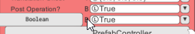 

If a certain mutable field can only take one of certain values in it, the tooltip will display the list of valid values that the field can take.  If the list is large (as in the image to the right), use the scroll wheel while the mouse is still on the character to scan up and down the list.

- A literal value takes in a string provided during package construction, and will parse that string into the proper value of the determined type.  This is used to store data literals that will not be modified by the package, including arithmetic values, vectors, and string constants.  If there is an error parsing the value, the box will highlight red to indicate the error.
   
 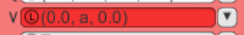 

- A mutable value takes a reference to a datum of the correct type provided by the MutableTarget of a node up the chain.  Instead of entering a string, a reference is selected from the dropdown:
   
 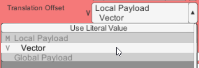 

This dropdown also provides a button to allow one to use a literal value instead of a mutable value.

## Adding a New Node to the Package Editor
Adding a new node to the Package Editor can be accessed via right click.  The Node Picker will display, allowing the designer to choose from a large list of different nodes.  A search function is available if the name of the desired node is known.
   
 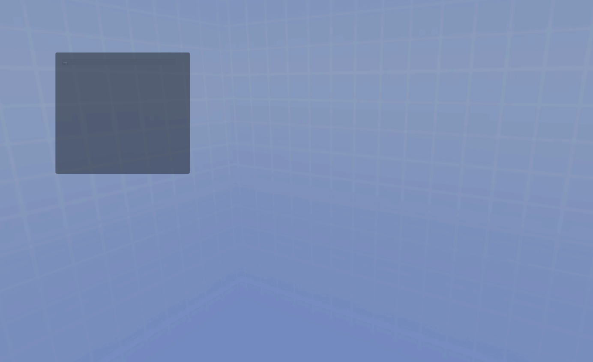 

Also available from the Node Picker is the option to create a new group.  Groups can be used to organize nodes, as well as a few other functions.
   
 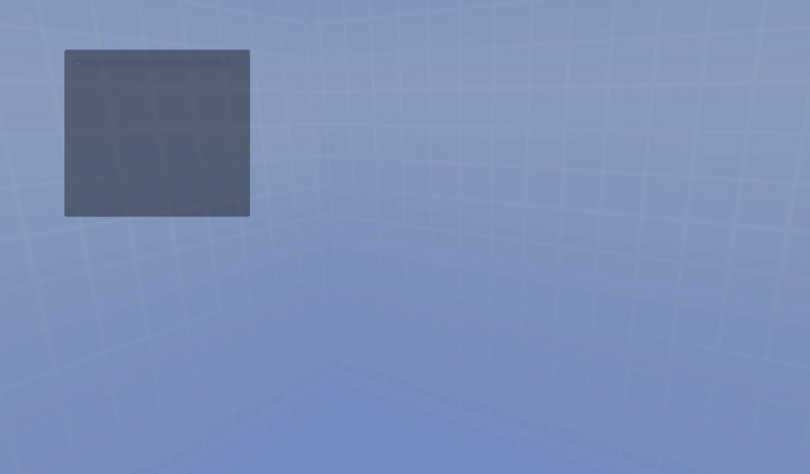 

Moving an existing node between groups can be accomplished by holding Control.  The target group will highlight white when it's about to accept the node.
   
 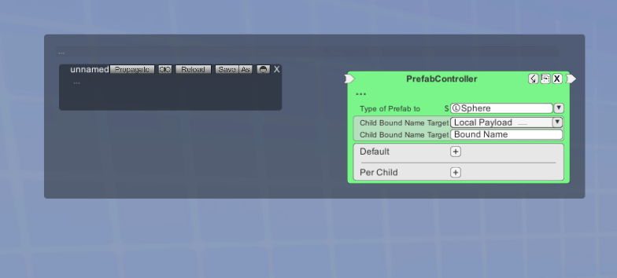 

## Comments
Nodes, groups, and the package as a whole have a space where a comment may be written.  Clicking on the space with three dots will allow you to enter a comment.
   
 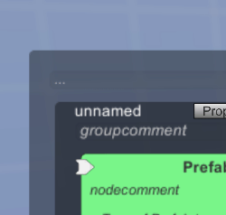 

## Manipulating the Package Editor
Zooming is accomplished by using the scroll wheel.
   
 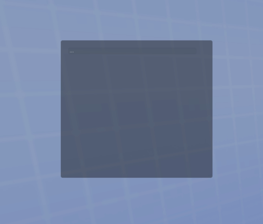 

Panning around the Package Editor is accomplished by dragging the Package Editor with the middle mouse button.
   
 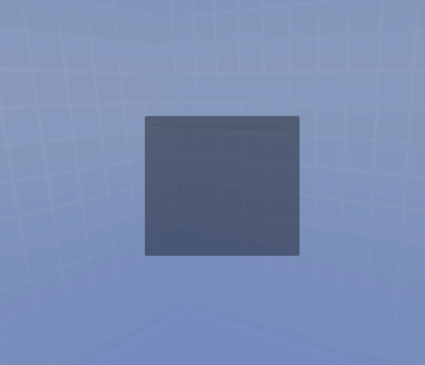 

Additionally, the Package Editor may be panned using the arrow keys.
   
 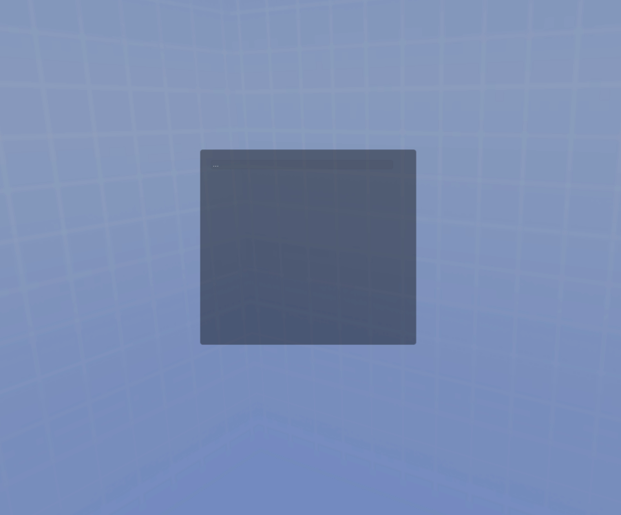 

If the Package Editor is fully pushed out of view, Haxxis will automatically snap it to the top left corner so the view is never lost.
   
 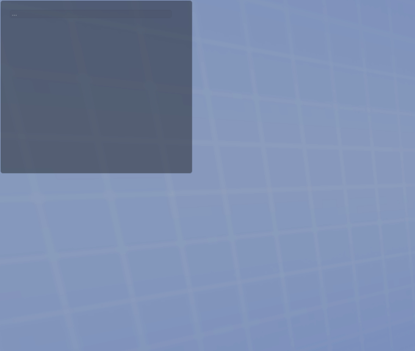 

## Search
To search for a specific string (including node names and mutable field names), press the F3 key to open the search prompt.  When a search is executed, any instance of the search term will create a vibrant, blinking highlight.
   
 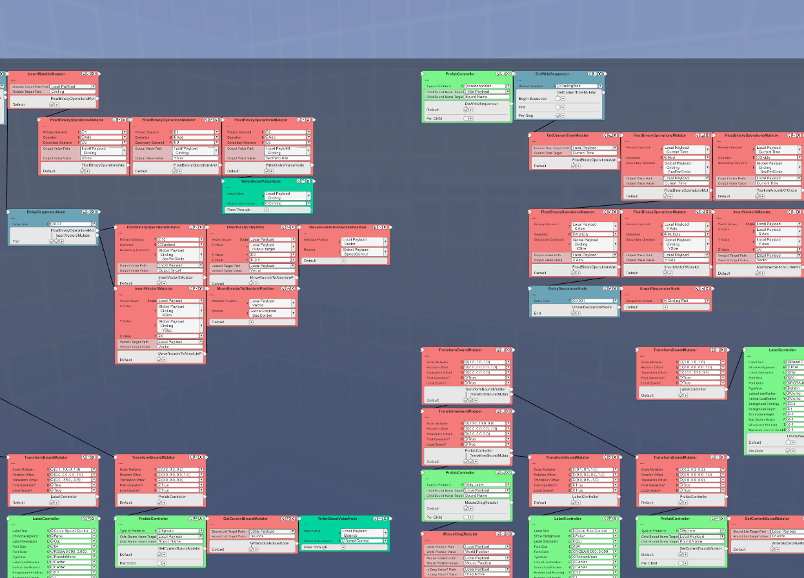 

## The File Menu
At the top right of the Package Editor is the File Menu:
   
 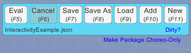 

The File Menu has the following actions available to you:
- Eval will evaluate the current package, ingesting the necessary data and producing a visualization from it.
- Cancel will stop any long-running evaluation.
- Add will load a new package from a specified file and add it as a new group to the package currently being modified.
- Save, Save As, Load, and New
- "Dirty?" will test if the package currently loaded has been modified.
- "Make Package Choreo-Only" will remove all of the nodes in the package, leaving only the choreography.  This can be used to copy choreography from one package to another via the Add button.  Use of this feature requires that Control and Shift are held down to prevent accidental package wiping.

## Group Actions
Additionally, each Group has several actions that can be performed on it:
   
 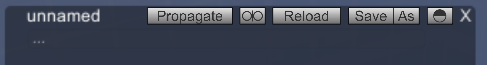 

On the bar are several buttons.  From left to right:
- Propagate will check every other package in the HaxxisPackages directory and test if this group is used in that package.  If so, every instance of this group in that package is updated to match this group, re-linking Chain Nodes as best as possible.  This functionality requires this group is saved as its own file first.
- Divorce unlinks this group from the file it originated from, if such a file exists.
- Reload will replace the contents of the group with the version that exists in the group's linked file.  If no such file exists, then nothing will happen.
- Save and (Save) As will allow you to save a group to its own file.
- Toggle Visibility will toggle the visibility of all Chain Nodes in the group; this does not prevent the nodes from executing on evaluation.
- Delete will remove this group from the Package Editor.
