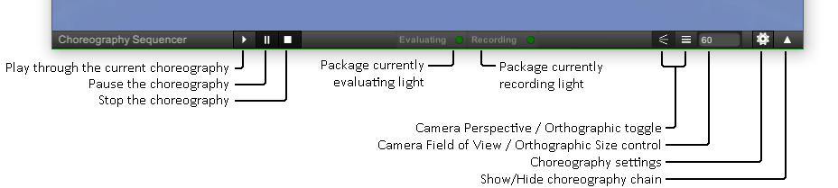
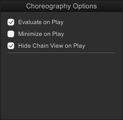
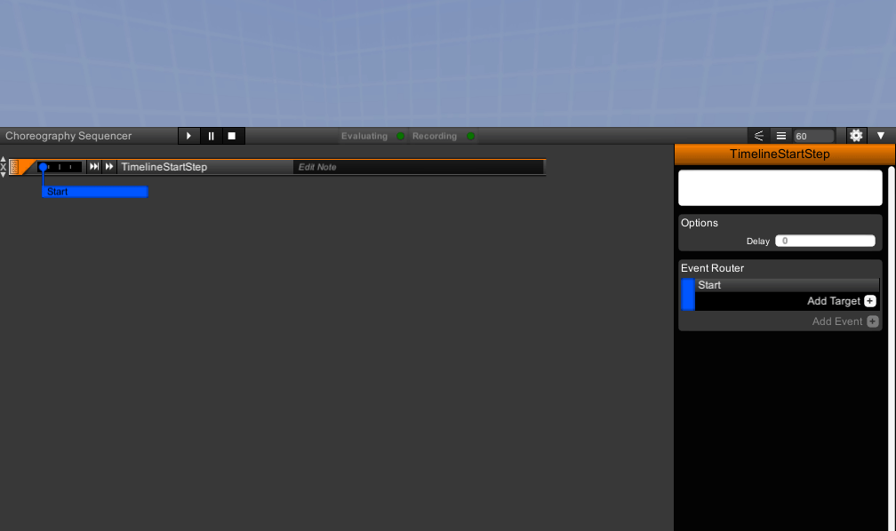
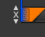
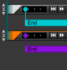
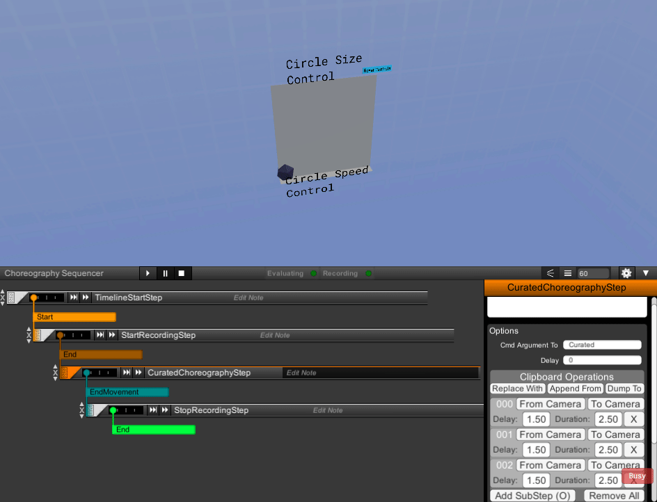

## Overview
Haxxis uses a choreography system to allow packages to manipulate camera position, start and stop video recording, change camera properties, and wait/unwait package execution events.  Each package includes one or more choreography steps, which are compartmentalized time-dependent code blocks.  Like nodes, choreography steps can be connected together into trees, forming a pattern of time-dependent actions that will be executed when the package is played.  Every choreography sequence starts with a TimelineStartStep; this step provides the entry point to visualization timing.  All other steps depend from that step, directly or indirectly.

The choreography view allows one to script how to manipulate the camera to provide the best view of the visualization.  The top bar has several controls on it:
   
  

   
  

## Settings Panel

The choreography settings panel allows for some basic autonomous control when playing the choreography.

- Evaluate on Play forces the package's chains to execute their instructions before playing the choreography.  This guarantees the visualization is correct, however it might not be necessary if the visualization remains the same.
- Minimize on Play hides the choreography chain when the choreography is playing.  This only has an impact on real-time playback; recording ignores the choreography panel anyway.
- Hide Chain View on Play hides the Workspace when the choreography is playing.  This only has an impact on real-time playback; recording ignores the Workspace anyway.

## Editing the Choreography
To provide the instructions for the camera to follow, the choreography consists of a singular chain of special nodes (called steps) invariably starting with a TimelineStartStep - this step is automatically provided for you and cannot be removed.

Selecting a step with a left-click will open its Editor, which provides access to the step's variables to modify how it behaves.
   
  

Adding more steps to the choreography is performed by selecting the "Add Target" button and choosing the new step from the Step Picker.  The Step Picker also offers a similar search function to the Node Picker.
   
  

To remove a step from the choreography, click on the X to the left of the step.
   
  

The up and down arrow buttons can be used to move a step up or down one position.
   
  

The block on the left edge of a step can be dragged to move steps into the target of a different step.
   
  

All steps have a 'Delay' property that allows the user to add a delay time, measured in seconds, before the step begins its activation.
## Starting and Ending a Recording
In order to produce a video packages utilize a StartRecording step and a StopRecording step.  If recording is enabled (see the choreography setting above) the StartRecording step will utilize FFMPEG to begin capturing a video from Haxxis, while a StopRecording step will conclude any recording in progress.  It is possible for a package to utilize more than one start- or stop-recording step; generally these cases are used to produce one of a variety of camera movements dependent upon a command line argument.
## Moving and Rotating the Camera
Most packages utilize at least one MoveToPositionAndFacing step.  This step transitions the camera smoothly from one location to another.  Each such step includes a position and facing which are serialized alongside the step and can be set from the editor.  To do so move the camera to the desired position and direction before pressing the 'From Camera' button in the step's properties window to store a position.  To view the position from such a step use the 'To Camera' button to place the camera in the position and facing stored within the step.  MoveToPositionAndFacing steps include a number of ease and interpolation options which can be set from the step properties window.
   
  

## CuratedChoreography
Some packages include a CuratedChoreography step.  This step contains zero or more sub-steps, each of which stores a position, facing, delay, and duration.  To produce such a sequence create a CuratedChoreography step and move the camera to the first desired position.  Pressing the O key or the Add SubStep button will record the camera's current position and orientation into a new sub-step that is appended to the running list.  Hovering over a sub-step in the list will produce a green frustum outline used to hint at that sub-step's position and facing.
   
  

The clipboard operation buttons offer batch operations to CuratedChoreography steps.  "Dump To" serializes all of the sub-steps into a string and places it into the system clipboard.  "Append From" takes the serialized string from the clipboard, parses it into a series of sub-steps, and appends them to the end of the list.  "Replace With" will replace the current sub-step list with the contents of the clipboard.
   
  

### From the Command Line
A CuratedChoreography step is typically used for its ability to ingest a command line argument to produce novel choreography without modifying the package; the serialized string produced by the "Dump To" command is used as the value to that argument.

When a command line string is specified in the CuratedChoreography step it will attempt to populate its sub-step list from a command line argument with the specified name.  For example, the FilamentView package uses an IfCommandLineExists step to determine whether the 'CuratedOverride' argument exists.  If it does rather than executing the normal choreography this step calls a CuratedChoreography step which processes the argument 'CuratedOverride'.
